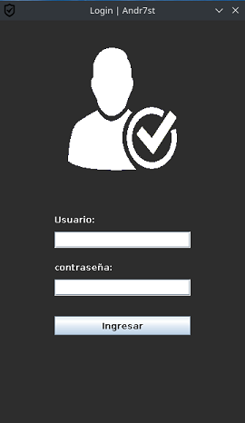

### Java-LoginForm

**Repository ID:** JF-E06

**EJERCICIO:** Creando ventana de login.

<!-- Download [**Demo**](demo/Demo.zip) -->

<a href="out/demo/Demo_JF-E06.zip" download> **Download demo** </a>

---
